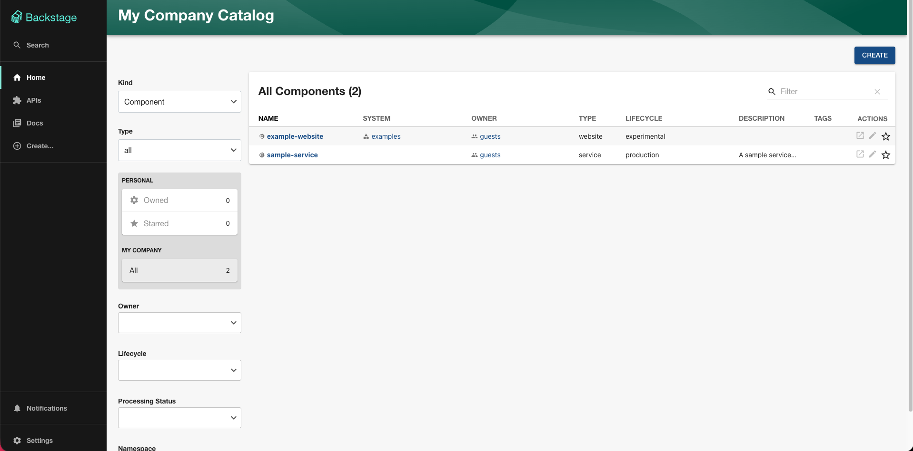
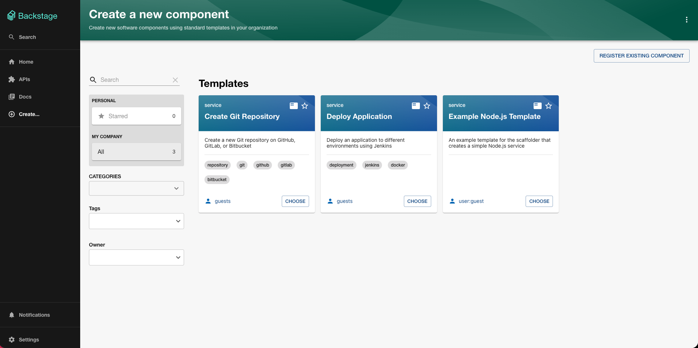
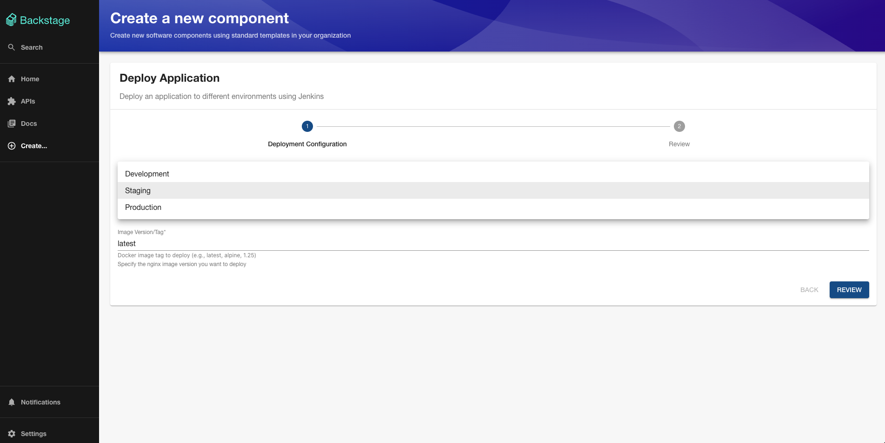
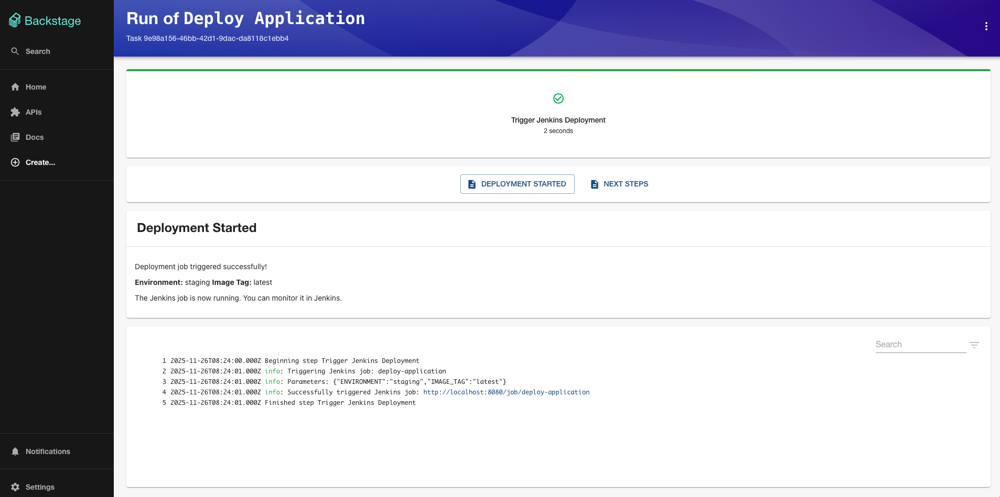
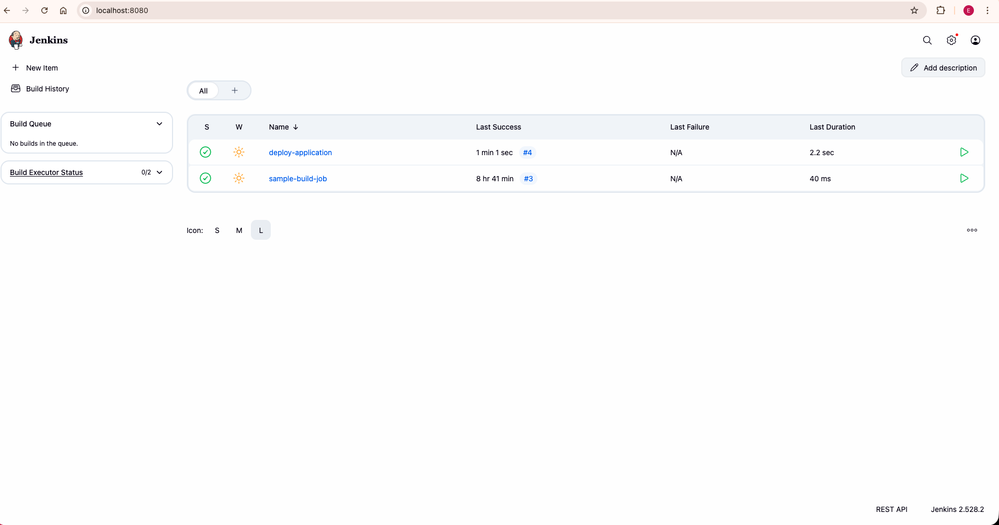
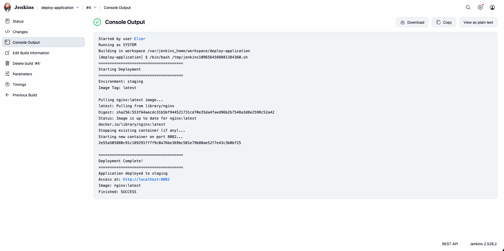
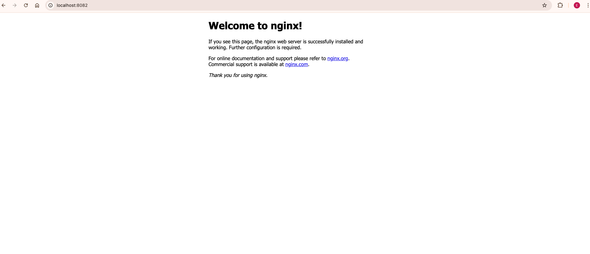
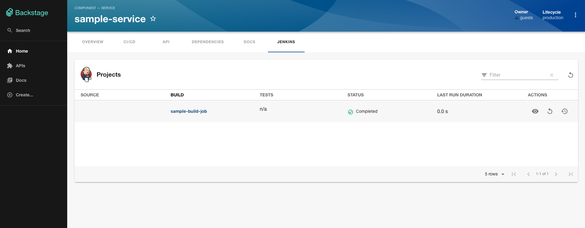

# Backstage & Jenkins Integration Project

A centralized Developer Portal using Backstage integrated with Jenkins for CI/CD automation and self-service actions.

## Table of Contents

- [Overview](#overview)
- [Architecture](#architecture)
- [Prerequisites](#prerequisites)
- [Installation & Setup](#installation--setup)
- [Features](#features)
- [Screenshots](#screenshots)
- [Troubleshooting](#troubleshooting)

---

## Overview

This project implements a fully functional Backstage Developer Portal integrated with Jenkins to enable development teams to perform common actions through a unified interface:

1. **Deploy Application** - Trigger parameterized Jenkins jobs to deploy Docker containers to different environments
2. **Create Git Repository** - Create new repositories directly from Backstage (without Jenkins)

---

## Architecture

```
┌─────────────────────────────────────────────────────────────┐
│                    Backstage Frontend                        │
│                   (React, Port 3000)                         │
└──────────────────────┬──────────────────────────────────────┘
                       │
                       │ HTTP/REST
                       │
┌──────────────────────▼──────────────────────────────────────┐
│                  Backstage Backend                           │
│                    (Node.js, Port 7007)                      │
│                                                              │
│  ┌────────────────────────────────────────────────────┐    │
│  │  Custom Scaffolder Actions                          │    │
│  │  - jenkins:job:trigger                              │    │
│  └────────────────────────────────────────────────────┘    │
│                                                              │
│  ┌────────────────────────────────────────────────────┐    │
│  │  Plugins                                            │    │
│  │  - Jenkins Plugin (@backstage/plugin-jenkins)       │    │
│  │  - Scaffolder (Software Templates)                  │    │
│  │  - Catalog                                          │    │
│  └────────────────────────────────────────────────────┘    │
└─────────┬─────────────────────────────────┬────────────────┘
          │                                 │
          │ REST API                        │ REST API
          │                                 │
┌─────────▼──────────────┐        ┌────────▼──────────────┐
│    Jenkins Server       │        │   GitHub API          │
│    (Port 8080)          │        │   (github.com)        │
│                         │        │                       │
│  Jobs:                  │        └───────────────────────┘
│  - sample-build-job     │
│  - deploy-application   │
│                         │
│  Executes:              │
│  - Docker commands      │
│  - Deployment scripts   │
└─────────────────────────┘
          │
          │ Docker Socket
          │
┌─────────▼──────────────┐
│   Docker Containers     │
│   - nginx-dev (8081)    │
│   - nginx-staging(8082) │
│   - nginx-prod (8083)   │
└─────────────────────────┘
```

---

## Prerequisites

Before running this project, ensure you have the following installed:

### Required Software

- **Node.js** (v18 or v20 LTS)
  ```bash
  node --version  # Version v18.x or v20.x
  ```

- **Yarn** (v1.22+)
  ```bash
  yarn --version
  ```

- **Docker** (v20.10+)
  ```bash
  docker --version
  docker ps  # Verify Docker is running
  ```

- **Git**
  ```bash
  git --version
  ```

### Required Accounts & Tokens

1. **GitHub Account** with:
   - Personal Access Token (PAT) with `repo` scope
   - [Create token here](https://github.com/settings/tokens)

2. **Jenkins** (will be set up via Docker)

---

## Installation & Setup

### Step 1: Clone the Repository

```bash
git clone <your-repo-url>
cd backstage-jenkins
```

### Step 2: Install Dependencies

```bash
yarn install
```

This will install all dependencies for both frontend and backend packages.

### Step 3: Set Up Jenkins

#### 3.1 Run Jenkins in Docker

```bash
docker run -d \
  --name jenkins \
  -p 8080:8080 \
  -p 50000:50000 \
  -v jenkins_home:/var/jenkins_home \
  -v /var/run/docker.sock:/var/run/docker.sock \
  -u root \
  jenkins/jenkins:lts
```

#### 3.2 Get Initial Admin Password

```bash
docker exec jenkins cat /var/jenkins_home/secrets/initialAdminPassword
```

Copy the password.

#### 3.3 Complete Jenkins Setup

1. Open http://localhost:8080
2. Paste the admin password
3. Click "Install suggested plugins"
4. Create your admin user (save credentials!)
5. Keep default Jenkins URL

#### 3.4 Install Docker CLI in Jenkins

```bash
docker exec -it -u root jenkins bash
apt-get update
apt-get install -y docker.io
docker --version  # Verify installation
exit
```

#### 3.5 Create Jenkins API Token

1. In Jenkins, click your username → **Configure**
2. Scroll to **API Token** section
3. Click **Add new Token** → **Generate**
4. **Copy the token** 

#### 3.6 Create Jenkins Jobs

**Job 1: sample-build-job**

1. Jenkins Dashboard → **New Item**
2. Name: `sample-build-job`
3. Type: **Freestyle project** → OK
4. Build Steps → Add → **Execute shell**:
   ```bash
   echo "Hello from Jenkins!"
   date
   ```
5. **Save** → **Build Now** (run it once)

**Job 2: deploy-application**

1. Jenkins Dashboard → **New Item**
2. Name: `deploy-application`
3. Type: **Freestyle project** → OK
4. Check ✅ **"This project is parameterized"**
5. Add parameters:
   - **Choice Parameter**:
     - Name: `ENVIRONMENT`
     - Choices: `dev`, `staging`, `prod` (one per line)
   - **String Parameter**:
     - Name: `IMAGE_TAG`
     - Default: `latest`
6. Build Steps → Add → **Execute shell**:
   ```bash
   #!/bin/bash
   echo "======================================"
   echo "Starting Deployment"
   echo "======================================"
   echo "Environment: ${ENVIRONMENT}"
   echo "Image Tag: ${IMAGE_TAG}"
   
   docker pull nginx:${IMAGE_TAG}
   
   docker stop nginx-${ENVIRONMENT} 2>/dev/null || true
   docker rm nginx-${ENVIRONMENT} 2>/dev/null || true
   
   if [ "${ENVIRONMENT}" = "dev" ]; then
       PORT=8081
   elif [ "${ENVIRONMENT}" = "staging" ]; then
       PORT=8082
   else
       PORT=8083
   fi
   
   docker run -d \
     --name nginx-${ENVIRONMENT} \
     -p ${PORT}:80 \
     nginx:${IMAGE_TAG}
   
   echo "======================================"
   echo "Deployment Complete!"
   echo "======================================"
   echo "Application deployed to ${ENVIRONMENT}"
   echo "Access at: http://localhost:${PORT}"
   ```
7. **Save**

### Step 4: Configure Backstage

#### 4.1 Create Configuration File

Copy the example config:

```bash
cp app-config.local.example.yaml app-config.local.yaml
```

#### 4.2 Edit app-config.local.yaml

Add your credentials:

```yaml
jenkins:
  instances:
    - name: default
      baseUrl: http://localhost:8080
      username: YOUR_JENKINS_USERNAME
      apiKey: YOUR_JENKINS_API_TOKEN

integrations:
  github:
    - host: github.com
      token: YOUR_GITHUB_PAT
```

Replace:
- `YOUR_JENKINS_USERNAME` - Your Jenkins username (e.g., `Admin`)
- `YOUR_JENKINS_API_TOKEN` - Token from step 3.5
- `YOUR_GITHUB_PAT` - Your GitHub Personal Access Token

**Important Notes:**
- ⚠️ **Use `app-config.local.yaml`, NOT `.env` file** - While `.env` files are common in many frameworks, Backstage doesn't load them by default. Using `app-config.local.yaml` is the standard Backstage approach and works out of the box.
- ✅ `app-config.local.yaml` is already in `.gitignore` and won't be committed to Git
- ✅ Backstage automatically merges `app-config.yaml` and `app-config.local.yaml`
- ✅ The local file takes precedence for any overlapping values

### Step 5: Start Backstage

```bash
yarn start
```

Wait for both frontend (port 3000) and backend (port 7007) to start.

### Step 6: Verify Installation

1. **Frontend**: http://localhost:3000
2. **Backend**: http://localhost:7007/api/catalog/entities
3. **Jenkins**: http://localhost:8080

---

## Features

### Feature 1: Deploy Application (via Jenkins)

**Purpose**: Deploy Docker containers to different environments using parameterized Jenkins jobs.

**How to Use**:

1. Navigate to http://localhost:3000/create
2. Click **"Deploy Application"**
3. Click **"Choose"**
4. Fill the form:
   - **Target Environment**: Select dev/staging/prod
   - **Image Version/Tag**: Enter version (e.g., `latest`, `alpine`)
5. Click **"Review"** → **"Create"**
6. Jenkins job triggers automatically
7. Access deployed app:
   - Dev: http://localhost:8081
   - Staging: http://localhost:8082
   - Prod: http://localhost:8083

**Technical Details**:
- Uses custom scaffolder action: `jenkins:job:trigger`
- Directly calls Jenkins REST API from Backstage backend
- No manual Jenkins interaction required
- Supports parameterized builds

### Feature 2: View Jenkins Build History

**Purpose**: Monitor CI/CD pipeline status directly in Backstage.

**How to Use**:

1. Navigate to **Catalog** in Backstage
2. Click on **sample-service**
3. Click the **Jenkins** tab
4. View build history, status, and timestamps

**Technical Details**:
- Uses `@backstage/plugin-jenkins`
- Configured via `jenkins.io/job-full-name` annotation
- Real-time build status

### Feature 3: Create Git Repository (Bonus - Partial Implementation)

**Purpose**: Create new GitHub repositories directly from Backstage.

**Status**: Template created but requires additional configuration for production use.

**Location**: `examples/templates/create-repo-template/`

---

## Project Structure

```
backstage/
├── packages/
│   ├── app/                          # Frontend React application
│   │   └── src/
│   │       └── components/
│   │           └── catalog/
│   │               └── EntityPage.tsx  # Jenkins tab integration
│   └── backend/                       # Backend Node.js application
│       └── src/
│           ├── index.ts               # Backend initialization
│           └── plugins/
│               └── scaffolder/
│                   └── actions/
│                       └── jenkins-trigger.ts  # Custom Jenkins action
├── examples/
│   ├── sample-service.yaml            # Sample service with Jenkins
│   └── templates/
│       ├── deploy-app-template.yaml   # Deploy application template
│       └── create-repo-template/      # Create repository template
│           ├── template.yaml
│           └── content/
│               ├── README.md
│               └── catalog-info.yaml
├── app-config.yaml                    # Main configuration (committed)
├── app-config.local.yaml             # Local secrets (NOT committed)
├── app-config.local.example.yaml     # Example config for setup
└── README.md                          # This file
```

---

## Screenshots

### 1. Backstage Home Page


### 2. Software Templates (Create Page)


### 3. Deploy Application Form


### 4. Deployment Success


### 5. Jenkins Job Triggered


### 6. Jenkins Build Console Output


### 7. Deployed Application


### 8. Jenkins Tab in Backstage

---

## Troubleshooting

### Backstage Won't Start

**Problem**: `yarn start` fails or shows errors

**Solutions**:
```bash
# Clean and reinstall
yarn clean
rm -rf node_modules
yarn install
```

### Jenkins API Authentication Fails

**Problem**: "401 Unauthorized" errors

**Solutions**:
- Verify Jenkins username is correct (case-sensitive)
- Regenerate API token in Jenkins
- Check `app-config.local.yaml` has correct credentials
- Restart Backstage after updating config

### Docker Commands Fail in Jenkins

**Problem**: "docker: command not found" in Jenkins

**Solution**:
```bash
# Install Docker CLI in Jenkins container
docker exec -it -u root jenkins bash
apt-get update && apt-get install -y docker.io
exit
```

### Template Not Showing

**Problem**: Deploy Application template doesn't appear

**Solutions**:
- Check `app-config.yaml` includes template location
- Verify YAML syntax is correct
- Check backend logs for errors
- Restart Backstage

### Port Already in Use

**Problem**: "Port 3000/7007/8080 already in use"

**Solutions**:
```bash
# Find and kill process
lsof -ti:3000 | xargs kill -9
lsof -ti:7007 | xargs kill -9

# Or restart Docker containers
docker restart jenkins
```

---

## Technologies Used

- **Backstage** - Developer Portal Platform
- **Jenkins** - CI/CD Automation Server
- **Docker** - Containerization
- **Node.js** - Backend runtime
- **React** - Frontend framework
- **TypeScript** - Type-safe development
- **GitHub API** - Repository management

---

## License

This project was created for educational purposes as part of a technical exercise.

---

## Contact

For questions or issues, please contact.